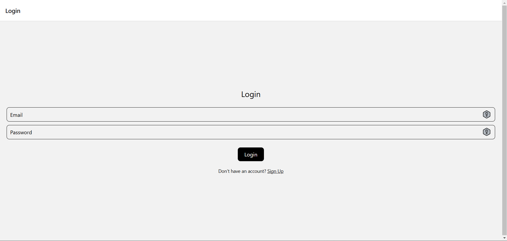
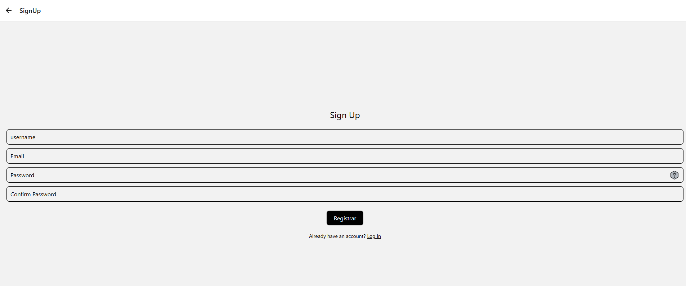
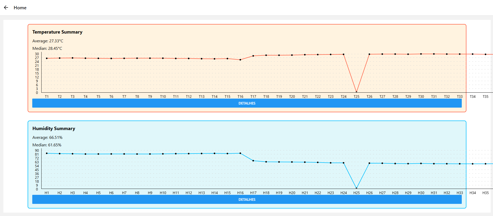
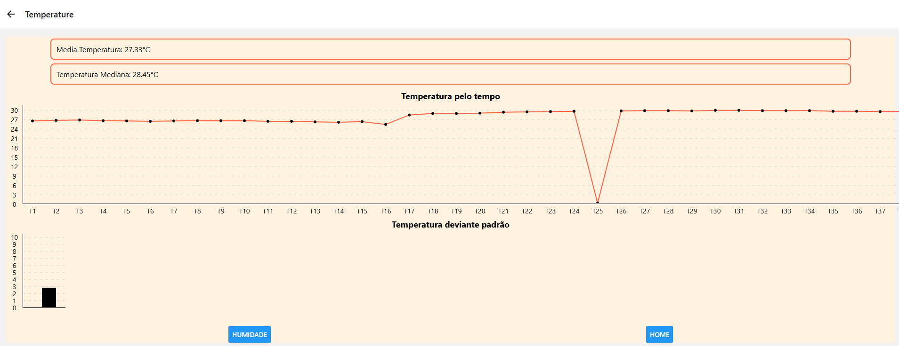
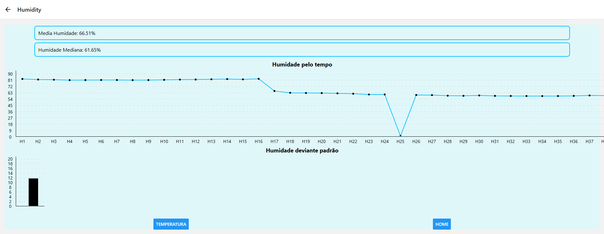
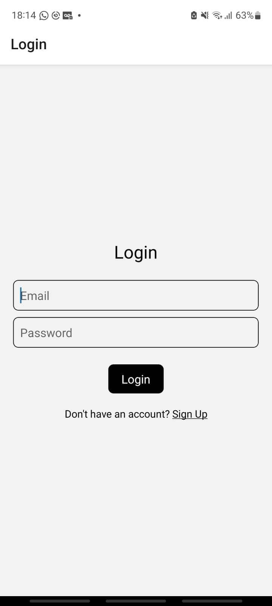
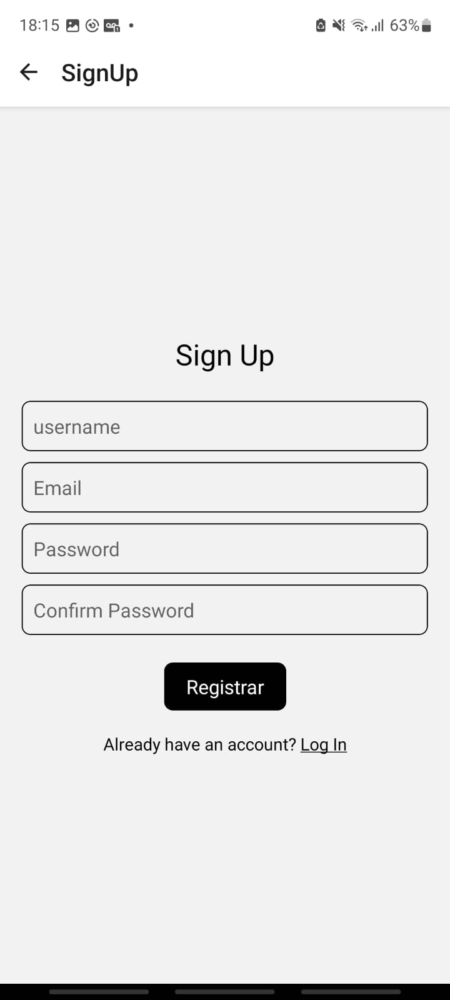
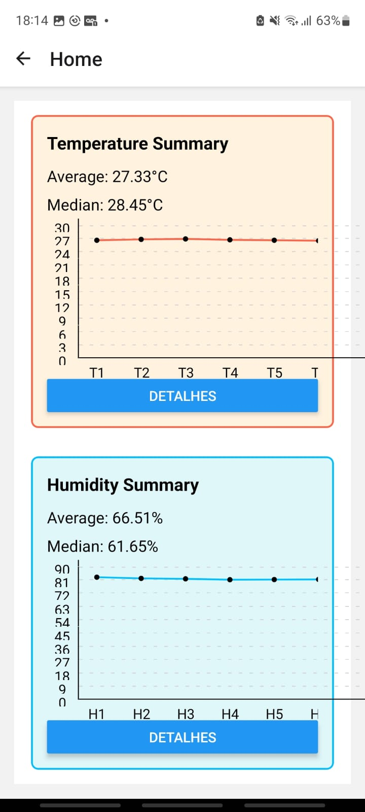
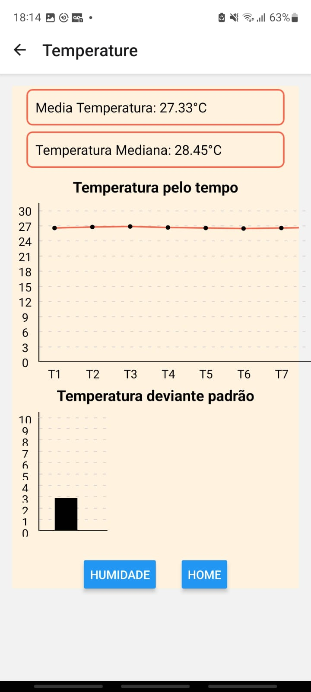
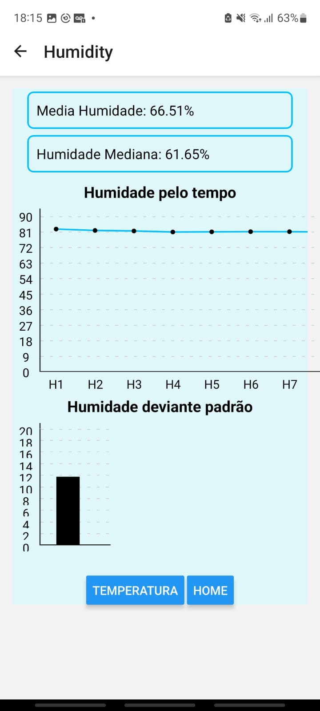

# Airlytics - Solução IoT para Monitoramento Ambiental

Airlytics é uma solução IoT para monitorar dados ambientais como temperatura e umidade. A aplicação coleta e exibe informações em tempo real em um painel interativo, com estatísticas e histórico. O sistema é composto por três módulos principais: Back-End, IoT e Front-End/Mobile.

## Informativo do Projeto

Este é um projeto desenvolvido para o curso de **Desenvolvimento de Software Multiplataforma** da **Faculdade Fatec Franca - Dr. Thomaz Novelino**.

## Estrutura do Projeto

- **Back-End**: Responsável pela API que processa e fornece os dados, incluindo cálculos estatísticos como média, mediana, moda, desvio padrão, assimetria, curtose, projeção futura e probabilidade.
- **IoT**: Coleta os dados ambientais usando dispositivos IoT.
- **Mobile/Front-End**: Interface interativa onde os usuários podem visualizar os dados em tempo real.

## Tecnologias Utilizadas

- **Front-End/Mobile**: React Native, Expo
- **Back-End**: Node.js
- **IoT**: Dispositivos IoT para captura de dados (temperatura e umidade)
- **Banco de Dados**: MongoDB

## Cálculos Estatísticos Realizados no Back-End

O Back-End realiza cálculos estatísticos com os dados coletados dos sensores de temperatura e umidade, incluindo:

- **Temperatura**:
  - Média
  - Mediana
  - Moda
  - Desvio Padrão
  - Assimetria
  - Curtose
  - Projeção Futura (próxima previsão)
  - Probabilidade
  - Distribuição

- **Umidade**:
  - Média
  - Mediana
  - Moda
  - Desvio Padrão
  - Assimetria
  - Curtose
  - Projeção Futura (próxima previsão)
  - Probabilidade
  - Distribuição

Para visualizar gráficos interativos com os dados, acesse o painel do Grafana com as imagens abaixo.


### Imagens do Web

Aqui você pode adicionar imagens da interface web da aplicação.







### Imagens do Mobile

Aqui você pode adicionar imagens da interface mobile da aplicação.







## Instruções para Rodar o Projeto

### 1. Rodar o Back-End
1. Navegue até o diretório **Backend**.
2. Execute os seguintes comandos:
    ```bash
    npm install
    node server
    ```

### 2. Rodar o IoT
1. Navegue até o diretório **IOT**.
2. Execute os seguintes comandos:
    ```bash
    npm install
    node app
    ```

### 3. Rodar o Front-End/Mobile
1. Navegue até o diretório **Mobile**.
2. Execute os seguintes comandos:
    ```bash
    npm install
    npx expo start
    ```

## Link para a Aplicação Front-End

Acesse a aplicação front-end em:

[Airlytics Front-End](https://airlytcs.vercel.app/)

## Link para as Rotas da API

Para visualizar todas as rotas da API, acesse o seguinte link:

[Documentação das Rotas da API](https://airlytcs-backend.onrender.com/api-docs/)

## Colaboradores

- **Cristian Tulio Garcia do Nascimento** - P.O (Product Owner)
- **Igor Owen Silva de Paula** - Estatísticas, Back-End, Documentação
- **Pedro Gonçalves Moreira** - Back-End, Front-End, Mobile e IoT
- **Vinicius Baldochi Cardoso** - Front-End
